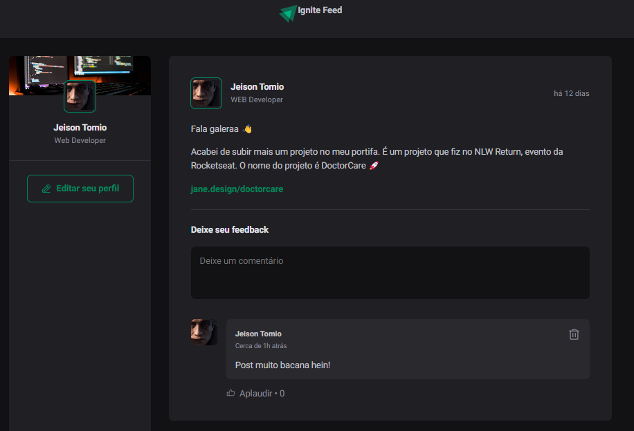

<h1 align="center">Project 1 - Ignite</h1>

<h1 align="center">
    <a href="https://pt-br.reactjs.org/">🔗 React</a>
</h1>
<p>🚀 Projeto desenvolvido na trilha do Ignite com foco no Front End com React</p>
<br>
<h4 align="center">
	🚧  React Select 🚀 Em construção...  🚧
</h4>

<br>

### Funções

- [x] Mostra imagem (Avatar) usuário
- [x] Inserir feedback nos post
- [x] Deletar feedback
- [ ] Editar seu perfil

### Preview



> 📌 Trilha Ignite - ReactJs - setembro 22.

### Pré-requisitos

Antes de começar, você vai precisar ter instalado em sua máquina as seguintes ferramentas:
[Git](https://git-scm.com), [Node.js](https://nodejs.org/en/).
Além disto é bom ter um editor para trabalhar com o código como [VSCode](https://code.visualstudio.com/)

### 🎲 Rodando o Front End ()

```bash
# Clone este repositório
$ git clone <https://github.com/Jtomio/ignite-frontend-project1-ts>

# Acesse a pasta do projeto no terminal/cmd
$ cd ignite-frontend-project1-ts

# Abra o projeto no VScode
$ code .

# Instale as dependências
$ npm install

# Execute a aplicação em modo de desenvolvimento
$ npm run dev:server

# O servidor inciará na porta:3333 - acesse <http://localhost:3333>
```

### 🛠 Tecnologias

As seguintes ferramentas foram usadas na construção do projeto:

- [Node.js](https://nodejs.org/en/)
- [React](https://pt-br.reactjs.org/)
- [TypeScript](https://www.typescriptlang.org/)

### Autor

---

<a href="https://github.com/Jtomio">
 
 <br />
 <sub><b>Jeison Tomio</b></sub></a>

👋🏽 Entre em contato!

[](https://www.linkedin.com/in/jeison-tomio/)
[](mailto:medriase@gmail.com)
